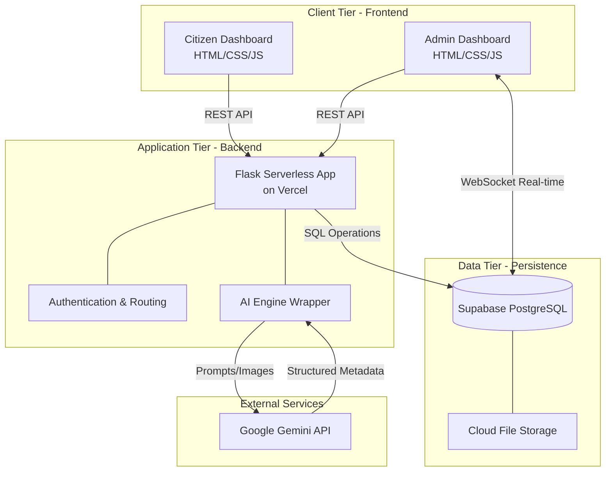
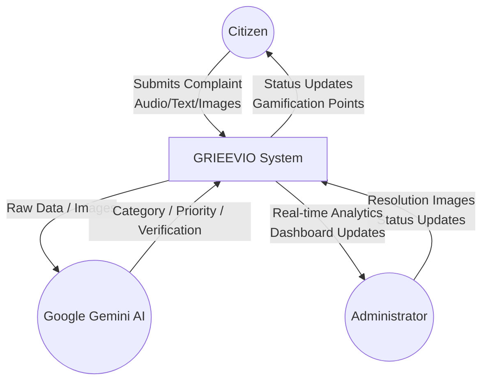
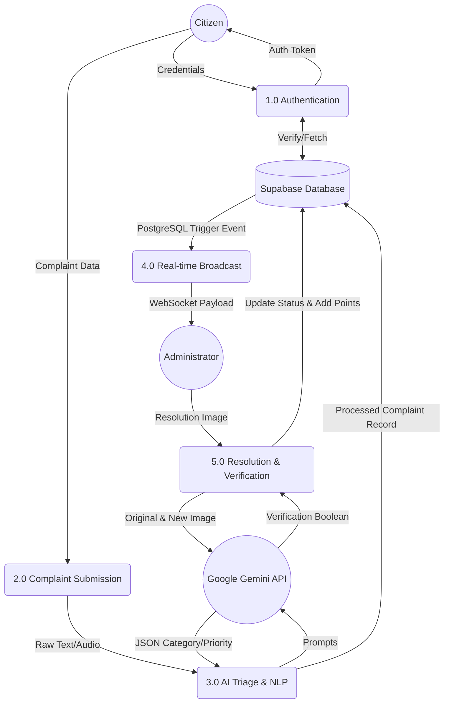

# GRIEEVIO: Smart Complaint Management System
## Detailed Project Report

---

## CONTENTS
1. [CHAPTER 1: INTRODUCTION](#chapter-1-introduction)
2. [CHAPTER 2: LITERATURE SURVEY](#chapter-2-literature-survey)
3. [CHAPTER 3: SYSTEM ANALYSIS](#chapter-3-system-analysis)
4. [CHAPTER 4: SYSTEM REQUIREMENTS](#chapter-4-system-requirements)
5. [CHAPTER 5: SYSTEM DESIGN](#chapter-5-system-design)
6. [CHAPTER 6: SYSTEM IMPLEMENTATION](#chapter-6-system-implementation)
7. [CHAPTER 7: TESTING](#chapter-7-testing)
8. [CHAPTER 8: SNAPSHOTS](#chapter-8-snapshots)
9. [CHAPTER 9: CONCLUSION](#chapter-9-conclusion)
10. [CHAPTER 10: FUTURE ENHANCEMENT & BIBLIOGRAPHY](#chapter-10-future-enhancement--bibliography)

---

## CHAPTER 1: INTRODUCTION

### 1.1 Introduction
Urban governance and civic maintenance are critical components of a functioning society. However, the traditional methods of reporting and resolving civic issues—such as potholes, broken streetlights, and water logging—are often plagued by bureaucratic delays, lack of transparency, and inefficient resource allocation. 

**GRIEEVIO** is an advanced, AI-powered Smart Complaint Management System designed to bridge the gap between citizens and municipal authorities. By leveraging modern web technologies, Artificial Intelligence (AI), and real-time database synchronization, GRIEEVIO provides a seamless, transparent, and gamified platform for reporting, tracking, and resolving civic complaints. The platform not only empowers citizens through a user-friendly interface but also equips administrators with predictive analytics and automated workflows to prioritize and assign tasks effectively.

### 1.2 Objective
The primary objectives of the GRIEEVIO project are to:
1. **Automate Complaint Triage:** Utilize Natural Language Processing (NLP) to automatically categorize and prioritize complaints based on their severity.
2. **Enhance Accessibility:** Provide multilingual support and voice-to-text capabilities to ensure the platform is accessible to all demographics, regardless of literacy or language barriers.
3. **Ensure Accountability:** Implement AI-driven visual verification (Proof of Work) to ensure that complaints are genuinely resolved before they are closed.
4. **Predictive Maintenance:** Analyze historical complaint data to generate predictive hotspot maps, allowing authorities to take preventive action.
5. **Increase Citizen Engagement:** Introduce a gamification system (points and badges) to incentivize citizens for reporting accurate and valuable civic issues.

### 1.3 Scope of the project
The scope of GRIEEVIO encompasses the development of a complete end-to-end web application featuring two primary interfaces:
- **Citizen Dashboard:** A portal for users to register, submit complaints (via text, voice, or image), track status, and view their gamification rewards.
- **Admin Dashboard:** A centralized control panel for municipal authorities providing real-time complaint updates, AI predictive hotspot maps, statistical charts, and operational management tools.

The system relies on cloud infrastructure (Vercel) and a robust Postgres database (Supabase) to ensure high availability, fast response times, and real-time data synchronization.

---

## CHAPTER 2: LITERATURE SURVEY

### 2.1 Technologies and Tools
The development of GRIEEVIO requires a modern technology stack capable of handling real-time data, AI integrations, and responsive user interfaces. 

#### 2.1.1 Python and Libraries
Python was selected as the core backend programming language due to its extensive support for AI and web development. The key libraries include:
- **Flask:** A lightweight, highly scalable micro-framework used to build the RESTful APIs and serve the backend architecture.
- **Flask-SQLAlchemy:** An Object Relational Mapper (ORM) used to bridge the Flask application with the PostgreSQL database.
- **SpeechRecognition & GoogleTrans:** Libraries utilized to provide accessibility features, allowing voice complaints to be transcribed and translated seamlessly into English for backend processing.
- **OpenCV (opencv-python-headless):** Used alongside AI models for backend image processing, ensuring that user-uploaded evidence is properly formatted before analysis.

#### 2.1.2 Machine Learning Models
GRIEEVIO heavily integrates Generative AI to automate mundane administrative tasks.
- **Google Gemini AI (google-generativeai):** This Large Language Model (LLM) acts as the core intelligence of the platform. It is responsible for:
  - Reading complaint descriptions and categorizing them (e.g., Roads, Sanitation, Lighting).
  - Assigning priority levels based on semantic sentiment analysis (e.g., flagging "accidents" as Critical).
  - **Vision AI Verification:** Analyzing "before" and "after" images to autonomously verify if a reported civic issue has been physically resolved by the assigned workers.

---

## CHAPTER 3: SYSTEM ANALYSIS

### 3.1 Existing System
Currently, municipal corporations rely on outdated complaint mechanisms, including:
- Manual paper-based forms at local municipal offices.
- Disconnected toll-free phone numbers with long wait times.
- Basic web portals that lack tracking capabilities, status updates, or transparency.

### 3.2 Problem Definition
The existing systems face several critical drawbacks:
1. **Manual Sorting:** Administrators must read and manually route thousands of complaints, leading to massive backlogs.
2. **Language Barriers:** Citizens who cannot write in English or the local administrative language struggle to report issues.
3. **False Resolutions:** Contractors often mark issues as "resolved" without actually performing the work, leading to public distrust.
4. **Lack of Data Utilization:** Historic data is rarely used to predict future infrastructure failures.

### 3.3 Proposed system
GRIEEVIO proposes a cloud-native, AI-first approach to solve these issues:
- **Automated Triage:** AI instantly reads, translates, categorizes, and prioritizes complaints the moment they are submitted.
- **Voice & Multi-Language Support:** Citizens can speak their complaints in their native tongue; the system automatically translates it for the admins.
- **Proof of Work (PoW):** Administrators must upload an image of the fixed issue. The AI analyzes the original complaint image against the resolution image to verify the fix.
- **Real-time Synchronization:** Utilizing Supabase, the admin dashboard updates instantaneously without requiring page reloads when new complaints arrive.

### 3.4 System Modules
1. **Authentication Module:** Secure registration and login using encrypted passwords.
2. **Citizen Portal Module:** Interfaces for creating complaints, uploading evidence, and viewing leaderboards.
3. **AI Engine Module:** The backend logic processing NLP, translation, and computer vision tasks.
4. **Admin Dashboard Module:** Visualizations, predictive maps (Leaflet.js), and operational controls for managing complaint lifecycles.

---

## CHAPTER 4: SYSTEM REQUIREMENTS

### 4.1 Hardware Requirements

**4.1.1 End-User (Citizen/Admin) Requirements:**
As a cloud-hosted web application, the hardware requirements for the end-user are minimal to ensure broad accessibility.
- **Device:** Smartphone, Tablet, Laptop, or Desktop computer.
- **Processor:** Intel Core i3 (or equivalent mobile processor like Snapdragon 6 series or Apple A10 Fusion) or higher.
- **RAM:** Minimum 2 GB (4 GB or more is recommended for the best experience).
- **Storage:** Minimal local storage required (cloud-based platform). Approximately 50MB for browser cache.
- **Network:** Stable Internet connection (Broadband, Wi-Fi, 3G/4G/5G mobile data). Minimum 1 Mbps speed is required for seamless image and audio uploads.
- **Peripherals:** Built-in or external Camera (for capturing photographic proof of issues and resolutions) and Microphone (for voice-to-text complaint reporting).

**4.1.2 Server-Side (Cloud Infrastructure) Requirements:**
- The platform operates on a Serverless Architecture managed by Vercel and Supabase.
- **Compute:** Auto-scaling CPU and RAM allocated dynamically based on active platform traffic.
- **Database Storage:** PostgreSQL hosted on Supabase, starting with 500 MB cloud database storage and automatically scaling as user data, complaints, and metadata increase.

### 4.2 Software Requirements

**4.2.1 End-User Requirements:**
- **Operating System:** Platform independent (Compatible with Windows 10/11, macOS, Linux distributions, Android 8.0+, iOS 12+).
- **Web Browser:** Modern HTML5/JavaScript compliant browsers such as Google Chrome 80+, Mozilla Firefox 75+, Safari 13+, or Microsoft Edge 80+.
- **Permissions:** Explicit browser permissions required for Camera access, Microphone access, and optionally Location Services (GPS) for mapping.

**4.2.2 Development & Server Environment:**
- **Backend Language:** Python 3.10+
- **Web Framework:** Flask 3.x (Micro-framework for API and routing)
- **Database:** PostgreSQL 14+ (Managed via Supabase)
- **Frontend Stack:** HTML5, CSS3 (Custom Glassmorphism styling), Vanilla JavaScript (ES6+).
- **Key Libraries & APIs:**
  - `Flask-SQLAlchemy` (for Object-Relational Mapping)
  - `google-generativeai` (Google Gemini API for NLP categorization and AI Vision verification)
  - `SpeechRecognition` & `googletrans` (for audio processing and native language translation)
  - `psycopg2-binary` (PostgreSQL database adapter)
- **Deployment Platform:** Vercel (for serverless execution, continuous integration, and static asset hosting).

### 4.3 Functional Requirements
The core features and functionalities the system must execute:
1. **User Authentication & Authorization:**
   - The system shall allow users to register and securely log in as either a "Citizen" or an "Admin".
   - Passwords must be securely hashed, and session management must keep users authenticated across page loads.
2. **Complaint Reporting & Accessibility (Citizen):**
   - Citizens shall be able to submit complaints regarding civic issues (e.g., roads, sanitation, water, electricity).
   - The system shall accept text descriptions, voice recordings (automatically transcribed to text), and image uploads as evidence.
   - The system shall automatically translate non-English complaints to English for backend processing and administrative review.
3. **AI-Powered Triage & Categorization:**
   - The system's AI engine (Gemini) shall automatically read the complaint description and categorize it accurately.
   - The AI shall perform sentiment and keyword analysis to assign a priority severity level (Low, Medium, High, Critical) to each complaint.
4. **Admin Dashboard & Operational Management:**
   - Administrators shall view all complaints on a centralized, secure dashboard.
   - Admins can filter, sort, and update the operational status of complaints (Pending, In Progress, Resolved).
   - The system shall provide analytical charts and predictive mapping of issue hotspots.
5. **Real-Time Data Synchronization:**
   - The Admin dashboard shall update in real-time when a new complaint is filed or a status changes, utilizing Supabase WebSockets, without requiring a manual page refresh.
6. **Proof of Work & AI Verification:**
   - Admins or field workers must upload a "resolution image" when closing a task.
   - The AI Vision model shall autonomously compare the original "before" image and the "after" image to verify the physical resolution before officially closing the complaint.
7. **Gamification & Citizen Engagement:**
   - The system shall award points and display badges to citizens for successfully verified complaints to incentivize active civic participation.

### 4.4 Non-Functional Requirements
The quality attributes, performance goals, and security constraints of the system:
1. **Performance & Responsiveness:**
   - The web application shall load within 3 seconds on standard broadband connections.
   - Real-time updates on the Admin dashboard shall reflect within 2 seconds of a database trigger.
   - AI processing (text categorization, translation, and image verification) should complete within a 3 to 7-second window.
2. **Scalability:**
   - The serverless architecture (Vercel) must automatically scale horizontally to handle concurrent user connections, ensuring high availability during traffic spikes (e.g., during natural disasters, monsoons, or public events).
3. **Security:**
   - All data transmission between the client and server must occur over secure HTTPS/SSL protocols.
   - User passwords must be strongly encrypted using hashing algorithms (e.g., werkzeug.security).
   - API endpoints (especially AI keys and Supabase credentials) must be protected using secure environment variables and not hardcoded into the source.
   - The application must employ basic protections against common web vulnerabilities (SQL Injection, XSS).
4. **Usability & Accessibility:**
   - The User Interface shall be fully responsive, adjusting seamlessly across mobile phones, tablets, and desktop monitors.
   - The UI shall employ a visually appealing, modern "Glassmorphism" design aesthetic.
   - The inclusion of Voice-to-Text and multilingual support ensures the platform is accessible to users with lower technical literacy or varying language preferences.
5. **Reliability & Availability:**
   - The system aims for a 99.9% uptime, leveraging robust cloud providers (Vercel, Supabase).
   - Database backups and fault tolerance should be managed by the cloud database provider to prevent data loss.

---

## CHAPTER 5: SYSTEM DESIGN

The system design of GRIEEVIO focuses on creating a scalable, real-time, and highly responsive platform by adopting a decoupled, modern three-tier architecture. This design ensures that the frontend, backend, and database can operate and scale independently while maintaining secure and efficient communication.

### 5.1 System Architecture

GRIEEVIO utilizes a cloud-native, serverless architecture divided into three primary tiers:



**5.1.1 Client Tier (Presentation Layer)**
The frontend is the direct point of interaction for both citizens and administrators. It is designed to be lightweight, fast, and accessible across all device form factors.
- **Technologies Used:** HTML5, CSS3 (implementing a custom Glassmorphism UI), and Vanilla JavaScript (ES6+).
- **Citizen Interface:** Provides intuitive forms for users to submit complaints using various multimedia formats (text, voice, and images). It also displays the user's gamification profile, showing earned badges and points.
- **Admin Interface:** Features a dynamic dashboard equipped with statistical charts and a real-time predictive hotspot map (using Leaflet.js). 
- **Communication:** The frontend communicates with the backend via RESTful APIs for traditional CRUD operations and maintains persistent WebSocket connections directly to Supabase to listen for real-time changes in the database.

**5.1.2 Application Tier (Business Logic Layer)**
This tier acts as the brain of the application, orchestrating data flow between the user, the database, and third-party AI services.
- **Framework & Hosting:** Built using Python and Flask, the backend is deployed as Serverless Functions on Vercel. This means the server scales automatically with traffic and only runs when invoked, optimizing costs and resources.
- **AI Engine Integration:** A crucial component of this tier is the `ai_engine.py` module. It acts as a wrapper around the Google Gemini API. When a complaint is received, this tier handles the complex logic of:
  1. Transcribing audio via voice-to-text libraries.
  2. Translating non-English text into English for processing.
  3. Formulating prompts for the Gemini LLM to extract the category, priority, and sentiment.
  4. Processing "before" and "after" images for automated resolution verification.
- **Security & Routing:** Handles user authentication, secure session management, and sanitizes all incoming payloads before they reach the database.

**5.1.3 Data Tier (Persistence Layer)**
The data layer is responsible for secure, persistent storage of structured and unstructured data.
- **Database:** PostgreSQL managed via Supabase. It offers robust relational data modeling with strict schemas for `users` and `complaints`.
- **Real-Time Synchronization:** Supabase provides out-of-the-box real-time capabilities. Whenever a record in the `complaints` table is inserted or updated, a PostgreSQL trigger fires, broadcasting the change via WebSockets to any connected Admin clients.
- **File Storage:** User-uploaded evidence (images and audio files) are managed via cloud storage, with their secure URLs saved within the corresponding PostgreSQL records.

### 5.2 Data Flow Diagram (DFD) Description

The following sections describe the logical flow of data through the system at various levels. These descriptions serve as a blueprint for visualizing the system's Data Flow Diagrams.

**5.2.1 Level 0 (Context Diagram)**
The Context Diagram represents the entire GRIEEVIO system as a single major process interacting with external entities.


- **Entities:** Citizen, Administrator, External AI Service (Google Gemini).
- **Flow:** 
  - *Citizen* inputs complaint details (audio/text/images) and receives status updates and gamification points in return.
  - *Admin* inputs resolution updates (completion images/status) and receives real-time analytical data and notifications from the system.
  - *System* sends raw data to the *External AI Service* and receives structured metadata (category, priority, verification status) in return.

**5.2.2 Level 1 (High-Level Data Flow)**
This level breaks the main system into primary sub-processes:


1. **Process 1.0 (Authentication):** User credentials flow in, are verified against the User Database, and an authentication token/session is returned.
2. **Process 2.0 (Complaint Submission):** Raw complaint data flows from the Citizen into the backend. If audio is present, it flows into an internal transcription sub-process.
3. **Process 3.0 (AI Triage):** Transcribed/translated text flows to the AI Engine, which queries the LLM and outputs a structured JSON object containing categorization and priority scores. This processed data is then inserted into the Complaints Database.
4. **Process 4.0 (Real-Time Broadcasting):** The database insertion triggers a real-time event that flows directly to the connected Admin Dashboard clients.
5. **Process 5.0 (Resolution & Verification):** The Admin submits a resolution image. The original image and the new image flow into the AI Vision module. The module returns a verification result. If true, the database is updated, and points flow into the Citizen's gamification profile.

**5.2.3 Detailed Data Flow (Complaint Lifecycle Example)**
- **Step 1 (Input):** User submits a voice note and an image.
- **Step 2 (Conversion):** Voice note is converted to text -> outputs localized text.
- **Step 3 (Translation):** Localized text -> translated -> outputs English text.
- **Step 4 (Inference):** English text -> sent to Gemini API -> returns structured data (e.g., `{ "category": "Roads", "priority": "High" }`).
- **Step 5 (Storage):** All processed data (Text, URLs, Category, Priority, UserID) -> inserted into Supabase PostgreSQL.
- **Step 6 (Event):** Supabase Realtime detects the `INSERT` -> broadcasts payload via WebSocket to the Admin Dashboard.
- **Step 7 (UI Update):** Admin JavaScript Client receives the payload -> dynamically injects the new row into the interface without reloading the page.

---

## CHAPTER 6: SYSTEM IMPLEMENTATION

The implementation of GRIEEVIO was carried out in a structured, phased approach to ensure each module was thoroughly developed and integrated. This chapter details the technical execution of the project.

### 6.1 Development Environment & Tooling
Before writing the core logic, a robust development environment was established:
- **IDE:** Visual Studio Code with Python and web development extensions.
- **Version Control:** Git was used for source code management, with the repository hosted on GitHub.
- **Virtual Environment:** A Python `venv` was initialized to isolate dependencies such as `Flask`, `SQLAlchemy`, and `google-generativeai`.
- **Environment Variables:** Sensitive keys (API keys, Database URIs) were stored in a `.env` file to prevent hardcoding secrets into the source code.

### 6.2 Database Implementation (Supabase)
The data layer was the first functional component to be implemented using Supabase (PostgreSQL).
- **Schema Design:** Two primary tables were created:
  - `users`: Storing citizen and admin credentials with securely hashed passwords.
  - `complaints`: Storing complaint metadata including `title`, `description`, `category`, `status`, `priority`, and URLs for evidence images.
- **Foreign Keys:** A relational link was established between the `complaints` table and the `users` table to track which citizen submitted which complaint.
- **Real-Time Configuration:** Using the Supabase Studio dashboard, the "Realtime" feature was explicitly toggled 'ON' for the `complaints` table, allowing the database to broadcast PostgreSQL triggers via WebSockets.
- **Storage Buckets:** A public storage bucket named `evidence` was configured to handle image and audio uploads directly.

### 6.3 Backend Implementation (Flask & Python)
The server logic acts as the middleware connecting the frontend, the database, and the AI models.
- **App Initialization:** `app.py` was created to initialize the Flask application and configure the SQLAlchemy database URI using environment variables.
- **API Endpoints:** RESTful routes were developed:
  - `POST /register` and `POST /login` for authentication.
  - `POST /submit_complaint` to handle form data, files, and audio blobs from the citizen dashboard.
  - `GET /admin_stats` to fetch aggregated data for the admin charts.
- **File Handling:** Logic was written to safely parse `multipart/form-data`, ensuring that uploaded images and audio are processed and temporarily stored before being sent to the AI engine or cloud storage.

### 6.4 AI Engine Integration (`ai_engine.py`)
This module is the core innovation of GRIEEVIO, abstracting all machine learning tasks.
- **Audio Processing:** The `SpeechRecognition` library was implemented to convert citizen audio blobs into localized text. If the text was non-English, `googletrans` was used to translate it into English.
- **Generative AI Triage:** The `google-generativeai` SDK was imported. A specific "system prompt" was engineered to instruct the Gemini LLM to act as a civic administrator. The prompt forces the LLM to output a structured JSON response containing the `category` and `priority` based on the complaint text.
- **Proof of Work (Vision AI):** The Gemini Vision model was integrated to accept two image inputs (the original citizen image and the admin's resolution image). The model analyzes the spatial and contextual differences between the two and returns a boolean value (`True` if the issue appears fixed, `False` otherwise).

### 6.5 Frontend Implementation
The user interfaces were built to be highly interactive and aesthetically modern.
- **Glassmorphism CSS:** A custom CSS stylesheet (`style.css`) was written to implement frosted glass effects (using `backdrop-filter: blur`), vibrant gradients, and responsive CSS Grid layouts.
- **Asynchronous Requests:** The Vanilla JavaScript `fetch` API was utilized extensively to submit forms to the Flask backend without causing page reloads, ensuring a smooth Single Page Application (SPA) feel.
- **Real-Time Client (Supabase JS):** On the Admin dashboard, the Supabase JavaScript Client SDK was imported. A WebSocket subscription was opened to listen for `INSERT` and `UPDATE` events on the `public:complaints` channel. When an event fires, the JS dynamically manipulates the DOM to add new rows or update status badges instantly.
- **Predictive Mapping:** `Leaflet.js` was integrated to render an interactive map on the admin dashboard, plotting complaint hotspots based on geocoordinates.

### 6.6 Serverless Deployment (Vercel)
To make the platform publicly accessible, it was deployed to Vercel's serverless infrastructure.
- **Vercel Configuration:** A `vercel.json` file was created at the root directory to instruct Vercel to treat `app.py` as a serverless function and route all incoming HTTP traffic to it.
- **Dependency Management:** All required Python packages were strictly versioned in `requirements.txt` to ensure Vercel's build container could install them successfully.
- **Environment Injection:** The `.env` variables were securely transferred to the Vercel Project Settings dashboard.

---

## CHAPTER 7: TESTING

### 7.1 Purpose Of Testing
The testing phase ensures that GRIEEVIO is robust, secure, and capable of handling edge cases (such as poorly worded complaints or blurred images) without crashing.

### 7.2 Types of Testing
- **Unit Testing:** Individual testing of the AI Engine functions (e.g., ensuring `detect_language` accurately identifies Hindi or Spanish).
- **Integration Testing:** Ensuring the Flask backend properly saves records to the Supabase Postgres database.
- **UI/UX Testing:** Verifying that the responsive grid layouts adapt correctly to mobile, tablet, and desktop screens.
- **Real-Time Testing:** Simulating a citizen complaint submission and verifying that the Admin dashboard updates instantaneously without a page refresh.

### 7.3 Levels of Testing
1. **Component Level:** Testing individual HTML/JS elements (e.g., the Voice Recording button).
2. **System Level:** End-to-end testing of the entire complaint lifecycle, from submission to AI verification and final resolution.
3. **Acceptance Level:** Validating that the system meets the core objectives defined in Chapter 1.

---

## CHAPTER 8: SNAPSHOTS

### 8.1 Source code
*(Representative snippet of the AI Engine Integration)*
```python
def classify_complaint(text):
    """Uses LLM to categorize and prioritize complaints."""
    prompt = f"""
    Analyze the following civic complaint and categorize it.
    Complaint: "{text}"
    Categories: Roads, Water, Electricity, Sanitation, Garbage, Street Lighting, Others.
    Provide the output strictly in JSON format with keys: 'category', 'confidence', 'priority'.
    """
    response = model.generate_content(prompt)
    return parse_json(response)
```

### 8.2 Screenshots
*Note: In the final printed report, include the following screenshots:*
1. **Home Page:** Showcasing the modern glassmorphism landing page.
2. **Citizen Dashboard:** Displaying the gamification badge, points, and complaint submission form.
3. **Admin Dashboard:** Highlighting the real-time statistics, AI predictive hotspot map, and the complaint management table.

---

## CHAPTER 9: CONCLUSION
The **GRIEEVIO** project successfully demonstrates the immense potential of integrating Artificial Intelligence into civic governance. By replacing outdated, manual systems with an automated, multilingual, and real-time platform, municipal authorities can significantly reduce resolution times and allocate resources more intelligently. 

The implementation of "Proof of Work" visual verification ensures unprecedented accountability, while the gamification elements actively encourage citizens to participate in the upkeep of their city. Ultimately, GRIEEVIO serves as a highly scalable blueprint for modern smart cities looking to digitize their public works infrastructure.

---

## CHAPTER 10: FUTURE ENHANCEMENT & BIBLIOGRAPHY

### Future Enhancements
1. **Mobile Application:** Developing native iOS and Android applications using React Native or Flutter to utilize device-specific features like background GPS tracking.
2. **IoT Integration:** Integrating with smart city IoT sensors (e.g., smart dustbins that automatically generate complaints when full).
3. **Social Media Scraping:** Implementing a module to automatically scrape and log complaints from platforms like Twitter/X when the municipal handle is tagged.

### Bibliography
1. Flask Documentation: https://flask.palletsprojects.com/
2. Supabase Realtime Architecture: https://supabase.com/docs/guides/realtime
3. Google Generative AI (Gemini) API Documentation: https://ai.google.dev/
4. Leaflet.js Interactive Maps: https://leafletjs.com/
5. CSS Glassmorphism Principles: Modern Web Design Practices (2024).
