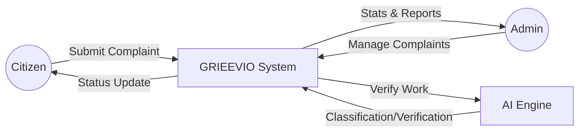
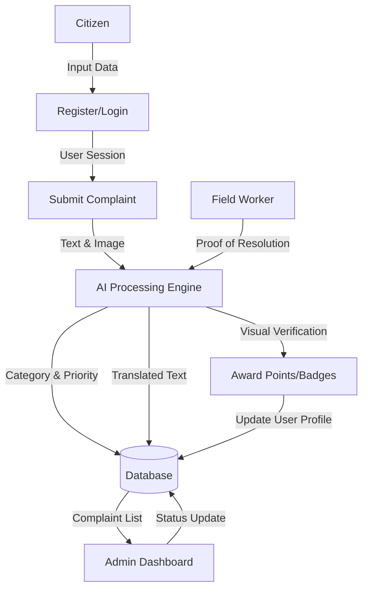

# GRIEEVIO Project Report

## Chapter 5: System Design

### System Architecture
The GRIEEVIO project is built on a scalable Client-Server architecture utilizing the Flask micro-framework for the backend and a modern responsive frontend. It features a decentralized AI Engine module that handles Natural Language Processing (NLP) for intelligent complaint categorization and Computer Vision for visual resolution verification. Data persistence is managed via an SQLite database with SQLAlchemy ORM for structured information storage. The system incorporates an autonomous escalation layer for SLA enforcement and a gamification engine to incentivize citizen participation. This multi-layered design ensures high performance, maintainability, and seamless integration of advanced AI services.

### Data Flow Diagram (DFD)

#### Level 0: Context Diagram


#### Level 1: Process Diagram


---

## Chapter 6: System Implementation

### Implementation Overview
The GRIEEVIO implementation integrates frontend responsiveness, backend logic, and AI intelligence into a cohesive civic governance platform.

#### 1. Frontend Implementation
- **Responsive UI**: Developed with vanilla HTML/CSS and JavaScript for maximum compatibility and performance.
- **Dynamic Dashboards**: Real-time tracking for citizens and a comprehensive management panel for administrators.
- **Accessibility**: Integrated Google Translate API for multi-lingual support and Web Speech API for voice-based complaint submission.

#### 2. Backend Implementation
- **Flask Framework**: Handles routing, API endpoints, and authentication using `Flask-Login`.
- **Database**: SQLite with `Flask-SQLAlchemy` for persistent storage of users, complaints, and AI scores.
- **SLA Management**: Automated logic to assign deadlines based on complaint priority and escalate overdue tickets.

#### 3. AI Core Implementation
- **NLP Engine**: A weighted keyword-based classifier that automatically assigns categories (Roads, Water, etc.) and priority levels.
- **Computer Vision**: ORB (Oriented FAST and Rotated BRIEF) feature matching algorithm implemented via OpenCV to verify if a "Before" and "After" photo represents the same location.
- **Predictive Analytics**: A clustering algorithm that identifies recurring complaint "hotspots" to help authorities with preventive maintenance.

---

## Chapter 7: Testing

### Purpose of Testing
The primary goal of testing GRIEEVIO is to ensure the reliability and accuracy of the automated grievance lifecycle. Testing validates that the AI accurately classifies inputs, visual verification correctly identifies resolved issues, and the system remains secure and responsive under varied user interactions.

### Types of Testing
1.  **Unit Testing**: Isolated testing of core logic such as the AI classification function in `ai_engine.py` and password hashing in `models.py`.
2.  **Integration Testing**: Verifying the communication between the Flask API endpoints, the AI module, and the database layer.
3.  **Functional Testing**: End-to-end testing of user flows including registration, complaint submission, and admin-led resolution.
4.  **UI/UX Testing**: Ensures the application layout adjusts correctly on mobile devices and all interactive elements provide clear feedback.

### Level of Testing
1.  **Component Level**: Verifying individual functions and classes.
2.  **System Level**: Testing the entire integrated application as a single entity.
3.  **Acceptance Level**: Validating the software against user requirements for civic governance.

---

## Chapter 8: Snapshots

### Source Code

#### 1. Configuration (`config.py`)
```python
import os

if os.environ.get('VERCEL'):
    BASE_DIR = '/tmp'
else:
    BASE_DIR = os.path.abspath(os.path.dirname(__file__))

class Config:
    SECRET_KEY = os.environ.get('SECRET_KEY', 'grieevio-secret-key-2026')
    SQLALCHEMY_DATABASE_URI = 'sqlite:///' + os.path.join(BASE_DIR, 'grieevio.db')
    SQLALCHEMY_TRACK_MODIFICATIONS = False
    UPLOAD_FOLDER = os.path.join(BASE_DIR, 'uploads')
    MAX_CONTENT_LENGTH = 16 * 1024 * 1024
```

#### 2. Database Models (`models.py`)
```python
from datetime import datetime
from flask_sqlalchemy import SQLAlchemy
from flask_login import UserMixin
from werkzeug.security import generate_password_hash, check_password_hash

db = SQLAlchemy()

class User(UserMixin, db.Model):
    __tablename__ = 'users'
    id = db.Column(db.Integer, primary_key=True)
    username = db.Column(db.String(80), unique=True, nullable=False)
    email = db.Column(db.String(120), unique=True, nullable=False)
    password_hash = db.Column(db.String(256), nullable=False)
    role = db.Column(db.String(20), default='citizen')
    points = db.Column(db.Integer, default=0)
    badge = db.Column(db.String(50), default='Citizen')

class Complaint(db.Model):
    __tablename__ = 'complaints'
    id = db.Column(db.Integer, primary_key=True)
    user_id = db.Column(db.Integer, db.ForeignKey('users.id'))
    title = db.Column(db.String(200), nullable=False)
    category = db.Column(db.String(50), default='Other')
    status = db.Column(db.String(30), default='Submitted')
    priority = db.Column(db.String(20), default='Medium')
    sla_deadline = db.Column(db.DateTime)
```

#### 3. AI Engine (`ai_engine.py`)
```python
import cv2
import numpy as np
from langdetect import detect
from googletrans import Translator

def classify_complaint(text):
    # Weighted keyword-based scoring logic
    ...

def verify_visual_resolution(before_path, after_path):
    # ORB feature matching for Proof of Work
    orb = cv2.ORB_create(nfeatures=500)
    # ... compare images ...
    return confidence > 30, round(confidence, 2)
```

#### 4. Main Application (`app.py`)
```python
from flask import Flask, render_template, request, jsonify
from models import db, User, Complaint
from ai_engine import classify_complaint

app = Flask(__name__)
# ... routes for auth, complaints, and AI ...

@app.route('/api/complaints', methods=['POST'])
def create_complaint():
    # ... handles AI classification and storage ...
```

### Screenshots
*(Screenshots to be included by the user in this section)*

---

## Chapter 9: Conclusion
GRIEEVIO has successfully demonstrated the potential of integrating artificial intelligence into civic governance to create a more responsive and transparent urban environment. By automating the classification and verification of grievances, the platform reduces administrative overhead and ensures that urgent issues are prioritized through intelligent SLA management. The inclusion of multi-lingual support and voice recognition makes the system accessible to a wider demographic, fostering community-driven city maintenance. Furthermore, the gamification and visual "Proof of Work" systems build trust between citizens and authorities by providing tangible rewards and verifiable results. Ultimately, GRIEEVIO serves as a scalable blueprint for modern smart cities, proving that data-driven solutions can significantly enhance the quality of life for urban residents.

---

## Chapter 10: Future Enhancement & Bibliography

### Future Enhancement
1.  **IoT-Enabled Infrastructure**: Integrating smart sensors in waste bins and street lights to automatically trigger complaints based on sensor data (e.g., bin overflow or light failure).
2.  **Blockchain Audit Trail**: Using a private blockchain to log every status change and verification step, ensuring an immutable record of governance actions.
3.  **Mobile Native Application**: Developing a dedicated mobile app for Android and iOS with background GPS tracking and push notifications for real-time updates.
4.  **Community Collaborative Voting**: Allowing neighbors to "upvote" local issues, which dynamically increases the priority of a complaint based on community consensus.

### Bibliography

**Books:**
1. *Flask Web Development: Developing Web Applications with Python* - Miguel Grinberg
2. *OpenCV 4 Computer Vision Projects with Python* - Joseph Howse
3. *Natural Language Processing in Action* - Hobson Lane

**References:**
1. Flask Official Documentation: https://flask.palletsprojects.com/
2. Python Speech Recognition Library: https://pypi.org/project/SpeechRecognition/
3. Google Translate API for Python: https://py-googletrans.readthedocs.io/
