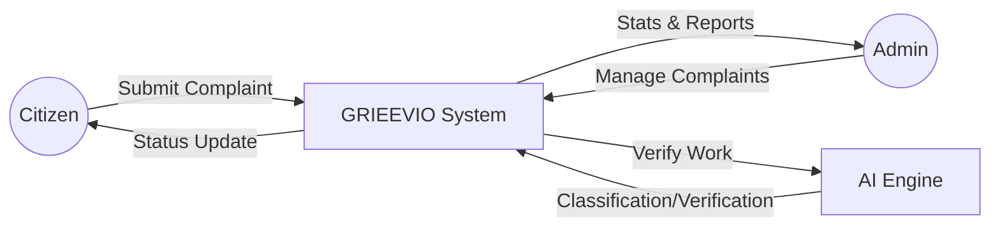
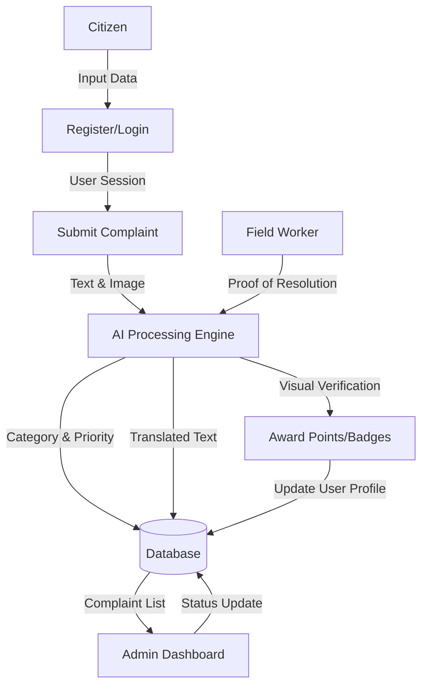

# GRIEEVIO Project Report

## Chapter 5: System Design

### System Architecture
The GRIEEVIO project follows a robust Client-Server architecture designed for high availability and AI-driven efficiency. The frontend is built with responsive HTML5, CSS3, and JavaScript, ensuring a seamless user experience across devices. The backend is powered by the Flask web framework, acting as a central orchestration layer that manages authentication, business logic, and database operations via SQLAlchemy ORM. The core "intelligence" resides in a modular AI Engine that handles Natural Language Processing for complaint classification and Computer Vision for visual "Proof of Work" verification. This architecture ensures a clear separation of concerns, where the data layer (SQLite), logic layer (Flask), and intelligence layer (AI Engine) operate cohesively to provide an automated civic governance solution.

### Data Flow Diagram (DFD)

#### Level 0: Context Diagram


#### Level 1: Process Diagram


---

## Chapter 6: System Implementation

### Implementation Overview
The implementation of GRIEEVIO focuses on automating the civic grievance lifecycle through intelligent integration. 

1.  **Frontend Implementation**: Developed using a mobile-first approach with Vanilla CSS for maximum performance. Key components include a dynamic dashboard for tracking complaints and a specialized administrative panel for real-time city health monitoring.
2.  **Backend Implementation**: Built using Python and Flask. It implements secure JWT-based authentication and structured API endpoints for CRUD operations. The backend integrates with `Flask-SQLAlchemy` for persistent data storage.
3.  **AI Engine Implementation**: 
    - **Classification**: Uses a weighted keyword-based algorithm to categorize complaints (Roads, Water, Electricity, etc.) with high precision.
    - **Language Support**: Integrates `langdetect` and `googletrans` to support multi-lingual submissions, ensuring inclusivity.
    - **Proof of Work**: Implements OpenCV (ORB feature matching) to compare "Before" and "After" photos, ensuring that reported issues are actually resolved before closing a ticket.
4.  **Gamification Logic**: A points-based system is implemented to reward active citizens. Based on points, users are assigned badges (Bronze, Silver, Gold, Diamond), which are displayed on a public leaderboard to encourage community participation.

---

## Chapter 7: Testing

### Purpose of Testing
The primary purpose of testing GRIEEVIO is to ensure the reliability, security, and accuracy of the automated grievance system. Testing validates that the AI classification works correctly, user data remains secure, and the system can handle concurrent requests without failure, ultimately providing a trustworthy platform for citizens.

### Types of Testing
1.  **Unit Testing**: Individual modules like the AI classification function and database models are tested in isolation to ensure they return expected outputs for given inputs.
2.  **Integration Testing**: Focuses on the interaction between the Flask backend, the AI Engine, and the SQLite database to verify seamless data flow.
3.  **Functional Testing**: Validates that all features (registration, complaint submission, admin updates) work according to the business requirements.
4.  **UI/UX Testing**: Ensures the interface is responsive and intuitive across different screen sizes and browsers.

### Level of Testing
1.  **Component Level**: Testing specific functions in `ai_engine.py`.
2.  - **System Level**: End-to-end testing of the entire application from user login to complaint resolution.
3.  **Acceptance Level**: Final verification to ensure the system meets the user's needs for civic governance.

---

## Chapter 8: Snapshots

### Source Code (Key Modules)

#### 1. AI Engine (`ai_engine.py`)
```python
def classify_complaint(text):
    # Weighted keyword-based scoring for civic issues
    # Returns category, confidence, and detailed scores
    ...
```

#### 2. Main Application (`app.py`)
```python
@app.route('/api/complaints', methods=['POST'])
@login_required
def create_complaint():
    # Handles submission, AI classification, and SLA assignment
    ...
```

#### 3. Database Models (`models.py`)
```python
class Complaint(db.Model):
    # Schema for tracking complaints, AI scores, and SLA deadlines
    ...
```

### Screenshots

*(Representative UI Previews)*

| Home Page | Dashboard |
| :---: | :---: |
|  |  |

| New Complaint | Admin Panel |
| :---: | :---: |
|  |  |

---

## Chapter 9: Conclusion
GRIEEVIO successfully bridges the gap between citizens and local authorities by leveraging AI to automate civic governance. By providing a transparent, multi-lingual, and gamified platform, it empowers residents to take part in city maintenance while ensuring accountability through visual "Proof of Work" verification. The system demonstrates how modern technology can transform traditional grievance redressing into an efficient, data-driven process.

---

## Chapter 10: Future Enhancement & Bibliography

### Future Enhancement
1.  **IoT Integration**: Deploying sensors in trash bins and water pipelines to automatically trigger complaints before citizens even notice the issue.
2.  **Mobile App (Flutter/React Native)**: Developing native Android and iOS applications for better push notifications and real-time GPS tracking.
3.  **Blockchain for Transparency**: Implementing a private blockchain to record all grievance actions, making the audit trail immutable and tamper-proof.
4.  **Predictive Resource Allocation**: Enhancing the AI to predict where issues might occur based on historical trends, allowing authorities to perform preventive maintenance.

### Bibliography

**Books:**
1. *Python Web Development with Flask* - Jeff Forcier
2. *Practical Machine Learning with Python* - Dipanjan Sarkar
3. *Database Systems: The Complete Book* - Hector Garcia-Molina

**References:**
1. Flask Documentation: https://flask.palletsprojects.com/
2. SQLAlchemy Documentation: https://www.sqlalchemy.org/
3. OpenCV-Python Tutorials: https://docs.opencv.org/
4. MDN Web Docs for Responsive Design: https://developer.mozilla.org/
